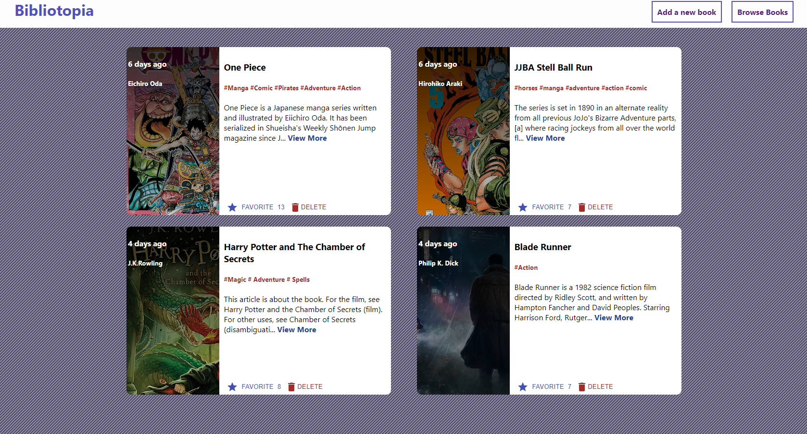

# Bibliotopia

  

## About

###### This is a FullStack Wep Application where users can add their book recomendations. They can input information such as Author, Book Title, A Description and an Image. Users can also update their posts or delete them as well as like posts made by them or other users.

## Technologies Used

- ###### CSS
- ###### MATERIAL-UI
- ###### NODE.js
- ###### EXPRESS.js
- ###### MONGODB
- ###### REACT.JS
- ###### REDUX

## Technical Information

### To run the site on your local machine

If you wish to run this locally you will to first need clone this repository to your local machine. Afterwards you will have to run npm install inside both the client and server folders for all the necessary dependencies to be installed. For the backend you will have to run the command npm start inside the server folder. The server will run on “http://localhost:5000/”. As for the Frontend you will need to run the command npm start inside the client folder. After that when all the configurations are done a new window should open automatically on your browser displaying the client side of the app which runs on “http://localhost:3000/”.
